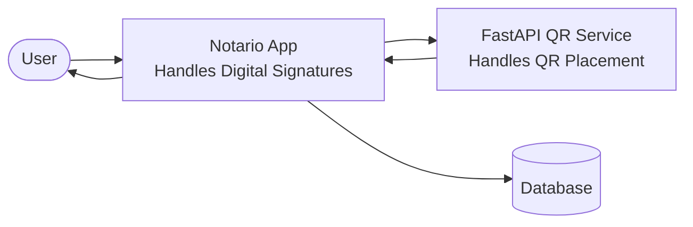
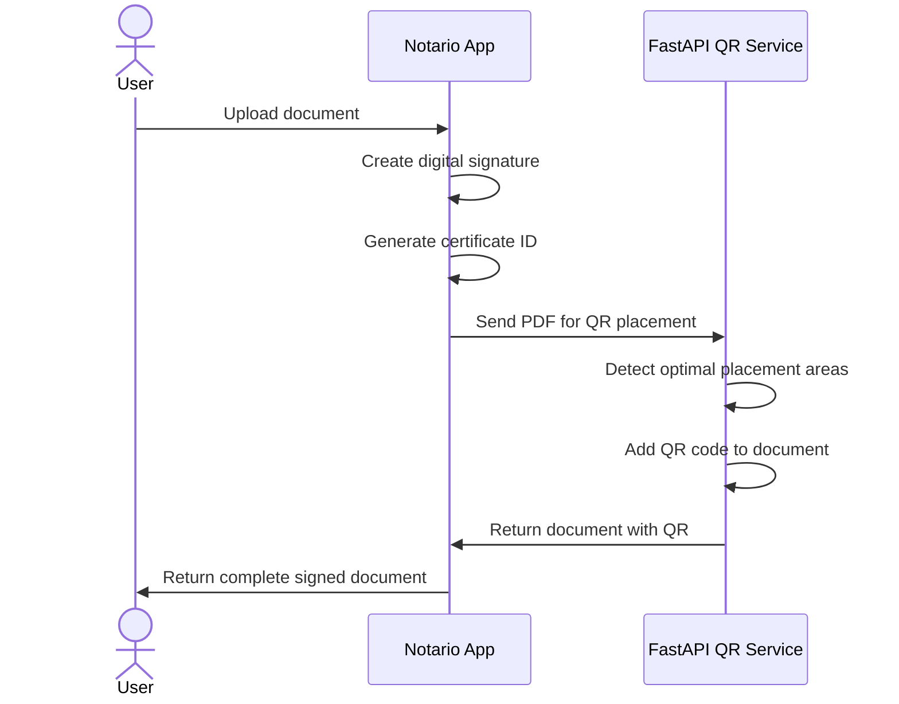
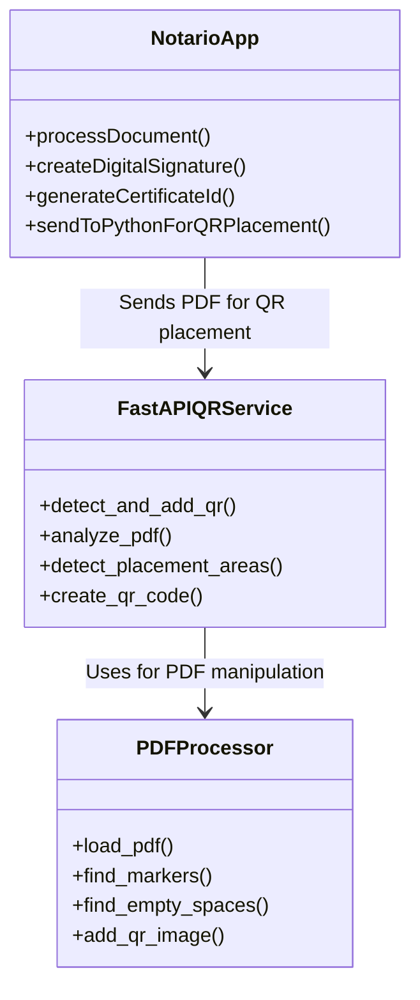
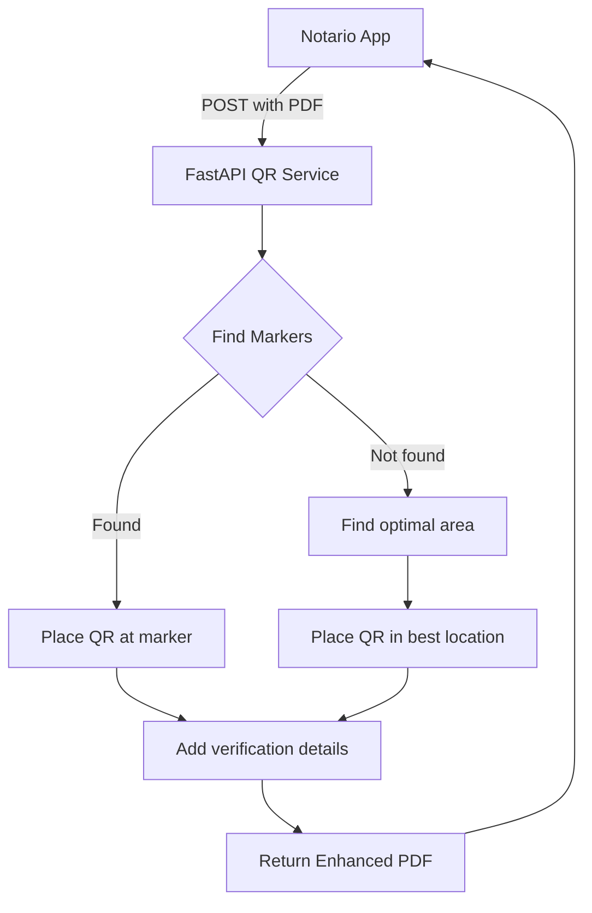

# FastAPI QR Code Placement Service

A specialized microservice built as part of an **Information Security course project** to solve QR code placement challenges for the [Notario](https://github.com/kudith/notario) document signing platform.

## 🎓 Academic Project Context

This repository was developed as part of an Information Security course project. It focuses specifically on the QR code placement component of the digital document signing workflow. The main digital signature functionality is handled by the primary Notario application.

## 🎯 Purpose

This service addresses a specific challenge in the document signing workflow: intelligently placing QR codes on documents. While the Notario application handles the core digital signature functionality, this Python-based service provides specialized PDF processing to detect optimal areas for QR code placement and ensure proper verification element positioning.

## 📊 System Architecture



## 🔄 Document Processing Workflow



## 📑 Problem Solved

While the Notario application handles the cryptographic aspects of digital signatures, it faced challenges with QR code placement:

1. Finding optimal areas in documents to place verification QR codes
2. Detecting explicit markers like `[[SIGN_HERE]]` in documents
3. Placing QR codes in visually appropriate locations
4. Adding verification elements with proper formatting

This Python-based microservice solves these specific challenges, leaving the actual digital signature operations to the main Notario application.

## 🚀 Features

- **Smart QR Placement Detection**: Automatically finds ideal locations for QR code placement
- **Marker-Based Positioning**: Detects specific markers like `[[SIGN_HERE]]` in documents
- **Advanced PDF Processing**: Handles complex PDF manipulation for QR placement
- **QR Code Generation**: Creates QR codes containing verification URLs
- **Visual Annotation**: Adds certificate IDs and verification details near QR codes

## 🔍 Technical Implementation



## 🛠️ Integration with Notario

This service is designed as a companion to the [Notario](https://github.com/kudith/notario) document signing platform. After Notario handles the digital signature process, it sends documents to this service solely for QR code placement, then receives back the documents with properly positioned QR codes.

### How It's Used in Notario

In the Notario application, after a document is digitally signed, the JavaScript frontend calls this Python service to handle the QR code placement:

```javascript
// From Notario's route.js
async function sendToPythonForQRPlacement(pdfBuffer, certificateId, verifyUrl) {
  try {
    console.log("Sending PDF to Python service for QR placement");
    
    // Create form data
    const formData = new FormData();
    formData.append('file', new Blob([pdfBuffer], { type: 'application/pdf' }), 'document.pdf');
    formData.append('marker', '[[SIGN_HERE]]');
    formData.append('qr_data', verifyUrl);
    formData.append('certificate_id', certificateId);
    
    // Send to Python service (this FastAPI QR service)
    const pythonServiceUrl = process.env.PYTHON_QR_SERVICE || 'http://localhost:8000';
    console.log(`Using Python service at ${pythonServiceUrl}`);
    
    const response = await fetch(`${pythonServiceUrl}/detect-and-add-qr`, {
      method: 'POST',
      body: formData,
    });
    
    // Handle response and return modified PDF
    if (!response.ok) {
      return null;
    }
    
    const modifiedPdfBuffer = Buffer.from(await response.arrayBuffer());
    return modifiedPdfBuffer;
  } catch (error) {
    console.error("Error communicating with Python QR service:", error);
    return null;
  }
}
```

## ✨ Visual Example

```
┌─────────────┐            ┌───────────────┐
│             │            │               │
│  Digitally  │    ┌─────> │ FastAPI QR    │
│  Signed Doc │    │       │ Service       │
│             │    │       │               │
└─────────────┘    │       └───────────────┘
       │           │               │
       ▼           │               ▼
┌─────────────┐    │       ┌───────────────┐
│             │    │       │               │
│  Notario    │────┘       │ Document with │
│  App        │            │ QR Code Added │
│             │ <──────────│               │
└─────────────┘            └───────────────┘
```

## 🎓 Role in Information Security Project

Within the larger Information Security course project, this service plays a specific role:

- **QR Verification**: Enables visual verification of document authenticity
- **Placement Optimization**: Ensures verification elements don't interfere with document content
- **Visual Trust Indicators**: Provides visible proof of document verification

The cryptographic security aspects (digital signatures, certificate management, etc.) are handled by the main Notario application.

## 🔧 Installation & Setup

### Prerequisites

- Python 3.8+
- Poetry (recommended for dependency management)

### Setup

1. Clone the repository:
   ```bash
   git clone https://github.com/kudith/fastapi_qr.git
   cd fastapi_qr
   ```

2. Install dependencies:
   ```bash
   poetry install
   # Or with pip
   pip install -r requirements.txt
   ```

3. Run the service:
   ```bash
   uvicorn app.main:app --reload
   ```

4. Configure the Notario application to use this service by setting the `PYTHON_QR_SERVICE` environment variable to the URL where this service is running.

## 📚 API Endpoints

### POST `/detect-and-add-qr`

Main endpoint used by Notario for QR code placement.



**Request**:
- Form data with:
  - `file`: PDF file to process
  - `marker`: Text marker to look for (e.g., `[[SIGN_HERE]]`)
  - `qr_data`: Verification URL to encode in QR code
  - `certificate_id`: Certificate ID to display with QR code

**Response**:
- Modified PDF file with QR code and verification details added

### POST `/analyze-pdf`

Analyzes a PDF for potential QR code placement areas without modifying it.

**Request**:
- Form data with:
  - `file`: PDF file to analyze

**Response**:
- JSON with analysis results including potential placement locations

### GET `/health`

Health check endpoint used by Notario to verify service availability.

## 🔄 Deployment

This service can be deployed alongside Notario or as a separate microservice:

- **Same Server**: Deploy on the same server as Notario for minimal latency
- **Separate Service**: Deploy as an independent service for better scaling
- **Container**: Use Docker to containerize the service

## 📝 Course Information

- **Course**: Information Security
- **Project Component**: QR Code Placement Service for Document Verification
- **Related Component**: Notario - Main document signing application handling digital signatures

## 📄 License

[MIT License](LICENSE)

## 👥 Contributing

This repository is a specialized component of an Information Security course project. Contributions related to improving QR code placement, marker detection, and PDF processing are welcome!
